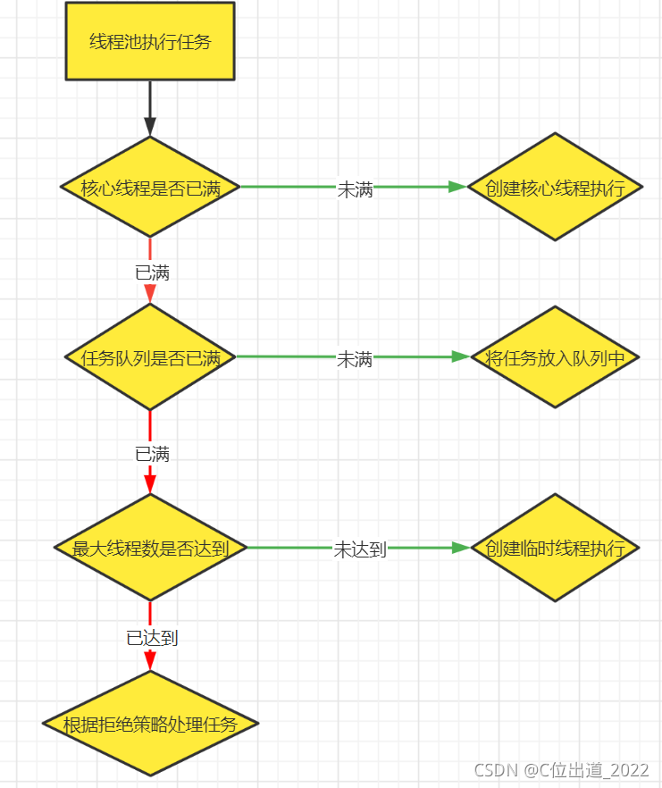

# 😀 1.Future和Callable接口


Future接口(**FutureTask实现类**)定义了操作**异步任务执行一些方法**，如获取异步任务的执行结果、取消任务的执行、判断任务是否被取消、判断任务执行是否完毕等。（异步：可以被叫停，可以被取消）

一句话：Future接口可以为主线程开一个分支任务，专门为主线程处理耗时和费力的复杂业务。


<figure><figcaption></figcaption></figure>

* 比如主线程让一个子线程去执行任务，子线程可能比较耗时，启动子线程开始执行任务后，主线程就去做其他事情了，过了一会才去获取子任务的执行结果。老师在上课，但是口渴，于是让班长这个线程去买水，自己可以继续上课，实现了异步任务。
* **有个目的：**异步多线程任务执行且有返回结果，三个特点：多线程/有返回/异步任务（班长作为老师去买水作为新启动的异步多线程任务且买到水有结果返回）

### FutureTask实现类 <a href="#v3lv6" id="v3lv6"></a>

* FutureTak(实现了x接口，x接口又继承了a和v接口)
*
  * 在源码可以看到，他既继承了RunnableFuture接口，也在构造方法中实现了Callable接口（有返回值、可抛出异常）和Runnable接口

(ctrl+alt+u)

<figure><figcaption></figcaption></figure>


<figure><figcaption></figcaption></figure>


完成上面目的的代码 - 多线程/有返回/异步

一个主线程，一个mythread|步执行了|返回了"hello callable"


```java
public class CompletableFutureDemo {
    public static void main(String[] args) throws ExecutionException, InterruptedException {
        FutureTask<String> futureTask = new FutureTask<>(new MyThread());
        Thread t1 = new Thread(futureTask,"t1");
        t1.start();
        System.out.println(futureTask.get());//接收返回值
    }
}

class MyThread implements Callable<String>{

    @Override
    public String call() throws Exception {
        System.out.println("-----come in call() ----异步执行");
        return "hello Callable 返回值";
    }
}
//结果
//-----come in call() ----异步执行
//hello Callable 返回值


```


### Future优点 <a href="#s6ol8" id="s6ol8"></a>

* **future**+**线程池**异步多线程任务配合，能显著提高程序的执行效率。
* 方案一，3个任务1个main线程处理，大概**60300ms**

```java
        //三个任务。 一个线程来处理、
        StopWatch stopWatch = new StopWatch();
        stopWatch.start("任务一执行");
        try {
            TimeUnit.SECONDS.sleep(2);
        } catch (Exception e) {
            e.printStackTrace();
        }
        stopWatch.stop();
        stopWatch.start("任务二执行");
        try {
            TimeUnit.SECONDS.sleep(2);
        } catch (Exception e) {
            e.printStackTrace();
        }
        stopWatch.stop();
        stopWatch.start("任务三执行");
        try {
            TimeUnit.SECONDS.sleep(2);
        } catch (Exception e) {
            e.printStackTrace();

        }
        stopWatch.stop();

        System.out.print("stopWatch = " + stopWatch.prettyPrint());
```

* 方案二，3个任务3个线程，利用线程池（假如每次new一个Thread，太浪费资源，会有GC这些工作），大概**13166毫秒。**

```java
        StopWatch stopWatch = new StopWatch();
        ExecutorService threadPool = Executors.newFixedThreadPool(3);
        stopWatch.start("任务一执行");
        FutureTask<String> task1 = new FutureTask<>(() -> {
            try {
                TimeUnit.SECONDS.sleep(2);
            } catch (Exception e) {
                e.printStackTrace();
            }
            return "任务一";
        });
        threadPool.submit(task1);
        stopWatch.stop();
        stopWatch.start("任务二执行");
        FutureTask<String> task2 = new FutureTask<>(() -> {
            try {
                TimeUnit.SECONDS.sleep(2);
            } catch (Exception e) {
                e.printStackTrace();
            }
            return "任务二";
        });
        threadPool.submit(task2);
        stopWatch.stop();
        stopWatch.start("任务三执行");
        FutureTask<String> task3 = new FutureTask<>(() -> {
            try {
                TimeUnit.SECONDS.sleep(2);
            } catch (Exception e) {
                e.printStackTrace();
            }
            return "任务三";
        });
        threadPool.submit(task3);
        stopWatch.stop();

        System.out.println("stopWatch = " + stopWatch.prettyPrint());

```

### Future缺点 <a href="#oyoe6" id="oyoe6"></a>

#### 1 get()阻塞 <a href="#lbemp" id="lbemp"></a>

一旦调用get()方法，不管是否计算完成，都会导致阻塞（所以一般get方法放到最后）


```java
 案例一：
 
ExecutorService threadPool = Executors.newFixedThreadPool(3);
        FutureTask<String> task1 = new FutureTask<>(() -> {
            System.out.printf("子线程:%s开始执行 " ,Thread.currentThread().getName());
            TimeUnit.SECONDS.sleep(5);//暂停几秒
            return "成功！";
        });
        threadPool.submit(task1);
        
        System.out.printf("父线程:%s执行！ " ,Thread.currentThread().getName());
        System.out.printf("子线程执行结果:%s", task1.get());

==================================
父线程:main执行！ 
子线程:pool-1-thread-1开始执行    


案例二：
        ExecutorService threadPool = Executors.newFixedThreadPool(3);
        FutureTask<String> task1 = new FutureTask<>(() -> {
            System.out.printf("子线程:%s开始执行 " ,Thread.currentThread().getName());
            TimeUnit.SECONDS.sleep(5);//暂停几秒
            return "成功！";
        });
        threadPool.submit(task1);
        System.out.printf("子线程执行结果:%s", task1.get());

        System.out.printf("父线程:%s执行！ " ,Thread.currentThread().getName());

子线程:pool-1-thread-1开始执行 

5s后打印下列内容
子线程执行结果:成功！
父线程:main执行！ 

```

#### 2 isDone()轮询 <a href="#rnxvk" id="rnxvk"></a>

利用if(futureTask.isDone())的方式使得他在结束之后才get(),但是也会消耗cpu


```java
    public static void main(String[] args) throws ExecutionException, InterruptedException {

        ExecutorService threadPool = Executors.newFixedThreadPool(3);
        FutureTask<String> task1 = new FutureTask<>(() -> {
            System.out.printf("子线程:%s开始执行 " ,Thread.currentThread().getName());
            TimeUnit.SECONDS.sleep(5);//暂停几秒
            return "成功！";
        });
        threadPool.submit(task1);
        System.out.printf("父线程:%s执行！ " ,Thread.currentThread().getName());


        while (true){
            if (task1.isDone()){
                System.out.println("执行结果：" + task1.get());
                break;
            }else {
                TimeUnit.SECONDS.sleep(1);//暂停几秒
                System.out.println("正在处理中------------正在处理中");
            }
        }

    }


=============
父线程:main执行！
子线程:pool-1-thread-1开始执行 
正在处理中------------正在处理中
正在处理中------------正在处理中
正在处理中------------正在处理中
正在处理中------------正在处理中
正在处理中------------正在处理中
执行结果：成功！
```

### Future应用现状 <a href="#r5f0w" id="r5f0w"></a>

* **对于简单的业务场景使用Future完全OK**

回调通知

前面的isDone()方法耗费cpu资源，一般应该还是利用回调函数，在Future结束时自动调用该回调函数。应对Future的完成时间，完成了可以告诉我，也就是我们的回调通知

创建异步任务

Future+线程池配合

多个任务前后依赖可以组合处理（水煮鱼）

想将多个异步任务的计算结果组合起来，后一个异步任务的计算结果需要前一个异步任务的值，将两个或多个异步计算合成一个异步计算，这几个异步计算相互独立，同时后面这个又依赖前一个处理的结果

比如买鱼-加料-烹饪

对计算速度选最快完成的（并返回结果）

当Future集合中某个任务最快结束时，返回结果，返回第一名处理结果


#### FutureTask

<figure><figcaption></figcaption></figure>


实现了 `Runnable` 的 `run()`，在方法结束时，获取返回值。

`V get()` 方法之所以能阻塞直到方法执行，拿到结果，是因为在 `get()` 方法通过 `awaitDone(boolean timed, long nanos)` 执行了一个无限循环。在循环过程中，不断获取任务执行的状态，进一步获取结果或者响应中断请求。

```java
/**
 * @throws CancellationException {@inheritDoc}
 */
public V get() throws InterruptedException, ExecutionException {
    int s = state;
    if (s <= COMPLETING)
        s = awaitDone(false, 0L);
    return report(s);
}

/**
 * Awaits completion or aborts on interrupt or timeout.
 *
 * @param timed true if use timed waits
 * @param nanos time to wait, if timed
 * @return state upon completion or at timeout
 */
private int awaitDone(boolean timed, long nanos)
    throws InterruptedException {
    // The code below is very delicate, to achieve these goals:
    // - call nanoTime exactly once for each call to park
    // - if nanos <= 0L, return promptly without allocation or nanoTime
    // - if nanos == Long.MIN_VALUE, don't underflow
    // - if nanos == Long.MAX_VALUE, and nanoTime is non-monotonic
    //   and we suffer a spurious wakeup, we will do no worse than
    //   to park-spin for a while
    long startTime = 0L;    // Special value 0L means not yet parked
    WaitNode q = null;
    boolean queued = false;
    for (;;) {
        int s = state;
        if (s > COMPLETING) {
            if (q != null)
                q.thread = null;
            return s;
        }
        else if (s == COMPLETING)
            // We may have already promised (via isDone) that we are done
            // so never return empty-handed or throw InterruptedException
            Thread.yield();
        else if (Thread.interrupted()) {
            removeWaiter(q);
            throw new InterruptedException();
        }
        else if (q == null) {
            if (timed && nanos <= 0L)
                return s;
            q = new WaitNode();
        }
        else if (!queued)
            queued = WAITERS.weakCompareAndSet(this, q.next = waiters, q);
        else if (timed) {
            final long parkNanos;
            if (startTime == 0L) { // first time
                startTime = System.nanoTime();
                if (startTime == 0L)
                    startTime = 1L;
                parkNanos = nanos;
            } else {
                long elapsed = System.nanoTime() - startTime;
                if (elapsed >= nanos) {
                    removeWaiter(q);
                    return state;
                }
                parkNanos = nanos - elapsed;
            }
            // nanoTime may be slow; recheck before parking
            if (state < COMPLETING)
                LockSupport.parkNanos(this, parkNanos);
        }
        else
            LockSupport.park(this);
    }
}
```


