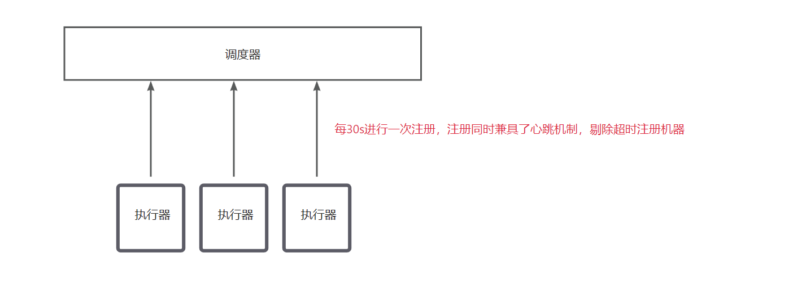

# 二、调度器启动流程及国际化

### 一、调度器启动流程： <a href="#eroib" id="eroib"></a>

#### 1.1.1首先找到配置类 XxlJobAdminConfig  <a href="#g4h1g" id="g4h1g"></a>

<figure><figcaption></figcaption></figure>


通过实现了**InitializingBean.afterPropertiesSet**，在spring初始化阶段，实例化了一个XxlJobScheduler对象，并调用init方法，打开init。

XxlJobScheduler.init():

```java
public void init() throws Exception {
        // init i18n
        //加载国际化配置
        initI18n();

        // admin trigger pool start
        //初始化触发器线程池
        JobTriggerPoolHelper.toStart();

        // admin registry monitor run
        //启动管理注册执行器的线程 30秒执行一次,维护注册表信息， 判断在线超时时间90s
        JobRegistryHelper.getInstance().start();

        // admin fail-monitor run
        //启动处理失败任务，触发报警的线程
        JobFailMonitorHelper.getInstance().start();

        // admin lose-monitor run ( depend on JobTriggerPoolHelper )
        ////将丢失主机信息调度日志更改状态
        JobCompleteHelper.getInstance().start();

        // admin log report start
        //  统计一些失败成功报表
        JobLogReportHelper.getInstance().start();

        // start-schedule  ( depend on JobTriggerPoolHelper )
        //执行调度器
        JobScheduleHelper.getInstance().start();

        logger.info(">>>>>>>>> init xxl-job admin success.");
    }
```

该方法主要做了如下事情：

* 加载国际化配置
* 启动管理注册执行器的线程
* 启动处理失败任务，触发报警的线程
* 启动处理“丢失”任务的线程
* 启动两个线程池，用于触发任务
* 启动生成调度报表数据的线程
* 启动两个调度器线程，一个处理粗粒任务，另一个使用时间轮处理秒级粒度任务。

可以看出有些线程设置成守护线程：

```java
xxxThread.setDaemon(true);
```

### 二、初始化线程与线程池详解 <a href="#wcako" id="wcako"></a>

JobTriggerPoolHelper.toStart();

```java
    public static void toStart() {java
        helper.start();
    }
```

```java
 public void start(){
        //最大200线程，最多处理1000任务
        fastTriggerPool = new ThreadPoolExecutor(
                10,
                XxlJobAdminConfig.getAdminConfig().getTriggerPoolFastMax(),
                60L,
                TimeUnit.SECONDS,
                new LinkedBlockingQueue<Runnable>(1000),
                new ThreadFactory() {
                    @Override
                    public Thread newThread(Runnable r) {
                        return new Thread(r, "xxl-job, admin JobTriggerPoolHelper-fastTriggerPool-" + r.hashCode());
                    }
                });

        //最大100线程，最多处理2000任务
        //一分钟内超时10次，则采用慢触发器执行
        slowTriggerPool = new ThreadPoolExecutor(
                10,
                XxlJobAdminConfig.getAdminConfig().getTriggerPoolSlowMax(),
                60L,
                TimeUnit.SECONDS,
                new LinkedBlockingQueue<Runnable>(2000),
                new ThreadFactory() {
                    @Override
                    public Thread newThread(Runnable r) {
                        return new Thread(r, "xxl-job, admin JobTriggerPoolHelper-slowTriggerPool-" + r.hashCode());
                    }
                });
    }
```

**注意：这里分别初始化了2个线程池，一个快一个慢，优先选择快，当一分钟以内任务超过10次执行时间超过500ms，则加入慢线程池执行。**

#### 三、执行器注册or下线线程详解 <a href="#d6ckd" id="d6ckd"></a>

xxl-job的执行器注册过程如下，执行器自启动开始，每30s进行一次注册，注册同时兼具了心跳机制。而调度器则是在接收到注册请求之后，判断该执行器是否已经注册，如果已注册，则更新心跳时间。

<figure><figcaption></figcaption></figure>


JobRegistryHelper.getInstance().start();

```java
public void start(){

		// for registry or remove
		//初始化删除注册执行器线程池
		registryOrRemoveThreadPool = new ThreadPoolExecutor(
				2,
				10,
				30L,
				TimeUnit.SECONDS,
				new LinkedBlockingQueue<Runnable>(2000),
				new ThreadFactory() {
					@Override
					public Thread newThread(Runnable r) {
						return new Thread(r, "xxl-job, admin JobRegistryMonitorHelper-registryOrRemoveThreadPool-" + r.hashCode());
					}
				},
				new RejectedExecutionHandler() {
					@Override
					public void rejectedExecution(Runnable r, ThreadPoolExecutor executor) {
						r.run();
						logger.warn(">>>>>>>>>>> xxl-job, registry or remove too fast, match threadpool rejected handler(run now).");
					}
				});

		// for monitor
		//30秒执行一次,维护注册表信息， 判断在线超时时间90s
		registryMonitorThread = new Thread(new Runnable() {
			@Override
			public void run() {
				while (!toStop) {
					try {
						// auto registry group
						List<XxlJobGroup> groupList = XxlJobAdminConfig.getAdminConfig().getXxlJobGroupDao().findByAddressType(0);
						if (groupList!=null && !groupList.isEmpty()) {

							// remove dead address (admin/executor)
							List<Integer> ids = XxlJobAdminConfig.getAdminConfig().getXxlJobRegistryDao().findDead(RegistryConfig.DEAD_TIMEOUT, new Date());
							if (ids!=null && ids.size()>0) {
								XxlJobAdminConfig.getAdminConfig().getXxlJobRegistryDao().removeDead(ids);
							}

							// fresh online address (admin/executor)
							HashMap<String, List<String>> appAddressMap = new HashMap<String, List<String>>();
							List<XxlJobRegistry> list = XxlJobAdminConfig.getAdminConfig().getXxlJobRegistryDao().findAll(RegistryConfig.DEAD_TIMEOUT, new Date());
							if (list != null) {
								for (XxlJobRegistry item: list) {
									if (RegistryConfig.RegistType.EXECUTOR.name().equals(item.getRegistryGroup())) {
										String appname = item.getRegistryKey();
										List<String> registryList = appAddressMap.get(appname);
										if (registryList == null) {
											registryList = new ArrayList<String>();
										}

										if (!registryList.contains(item.getRegistryValue())) {
											registryList.add(item.getRegistryValue());
										}
										appAddressMap.put(appname, registryList);
									}
								}
							}

							// fresh group address
							for (XxlJobGroup group: groupList) {
								List<String> registryList = appAddressMap.get(group.getAppname());
								String addressListStr = null;
								if (registryList!=null && !registryList.isEmpty()) {
									Collections.sort(registryList);
									StringBuilder addressListSB = new StringBuilder();
									for (String item:registryList) {
										addressListSB.append(item).append(",");
									}
									addressListStr = addressListSB.toString();
									addressListStr = addressListStr.substring(0, addressListStr.length()-1);
								}
								group.setAddressList(addressListStr);
								group.setUpdateTime(new Date());

								XxlJobAdminConfig.getAdminConfig().getXxlJobGroupDao().update(group);
							}
						}
					} catch (Exception e) {
						if (!toStop) {
							logger.error(">>>>>>>>>>> xxl-job, job registry monitor thread error:{}", e);
						}
					}
					try {
						TimeUnit.SECONDS.sleep(RegistryConfig.BEAT_TIMEOUT);
					} catch (InterruptedException e) {
						if (!toStop) {
							logger.error(">>>>>>>>>>> xxl-job, job registry monitor thread error:{}", e);
						}
					}
				}
				logger.info(">>>>>>>>>>> xxl-job, job registry monitor thread stop");
			}
		});
		registryMonitorThread.setDaemon(true);
		registryMonitorThread.setName("xxl-job, admin JobRegistryMonitorHelper-registryMonitorThread");
		registryMonitorThread.start();
	}
```

JobRegistryHelper做了以下事情：

* 初始化删除注册执行器线程池。
* 30秒执行一次,维护注册表（xxl\_job\_group）增加或更新信息， 判断在线超时时间90s。
* 移除超时的机器地址。

#### 四、处理失败任务，触发报警的线程 <a href="#ojpax" id="ojpax"></a>

4.1.1

JobFailMonitorHelper.getInstance().start();

```java
	public void start(){
		monitorThread = new Thread(new Runnable() {

			@Override
			public void run() {

				// monitor
				while (!toStop) {
					try {
						//获取执行失败的日志 调度日志表： 用于保存XXL-JOB任务调度的历史信息，如调度结果、执行结果、调度入参、调度机器和执行器等等；
						List<Long> failLogIds = XxlJobAdminConfig.getAdminConfig().getXxlJobLogDao().findFailJobLogIds(1000);
						if (failLogIds!=null && !failLogIds.isEmpty()) {
							for (long failLogId: failLogIds) {

								// lock log
								int lockRet = XxlJobAdminConfig.getAdminConfig().getXxlJobLogDao().updateAlarmStatus(failLogId, 0, -1);
								if (lockRet < 1) {
									continue;
								}
								XxlJobLog log = XxlJobAdminConfig.getAdminConfig().getXxlJobLogDao().load(failLogId);
								XxlJobInfo info = XxlJobAdminConfig.getAdminConfig().getXxlJobInfoDao().loadById(log.getJobId());

								// 1、fail retry monitor
								if (log.getExecutorFailRetryCount() > 0) {
									JobTriggerPoolHelper.trigger(log.getJobId(), TriggerTypeEnum.RETRY, (log.getExecutorFailRetryCount()-1), log.getExecutorShardingParam(), log.getExecutorParam(), null);
									String retryMsg = "<br><br><span style=\"color:#F39C12;\" > >>>>>>>>>>>"+ I18nUtil.getString("jobconf_trigger_type_retry") +"<<<<<<<<<<< </span><br>";
									log.setTriggerMsg(log.getTriggerMsg() + retryMsg);
									XxlJobAdminConfig.getAdminConfig().getXxlJobLogDao().updateTriggerInfo(log);
								}

								// 2、fail alarm monitor
								int newAlarmStatus = 0;		// 告警状态：0-默认、-1=锁定状态、1-无需告警、2-告警成功、3-告警失败
								if (info != null) {
									boolean alarmResult = XxlJobAdminConfig.getAdminConfig().getJobAlarmer().alarm(info, log);
									newAlarmStatus = alarmResult?2:3;
								} else {
									newAlarmStatus = 1;
								}

								XxlJobAdminConfig.getAdminConfig().getXxlJobLogDao().updateAlarmStatus(failLogId, -1, newAlarmStatus);
							}
						}

					} catch (Exception e) {
						if (!toStop) {
							logger.error(">>>>>>>>>>> xxl-job, job fail monitor thread error:{}", e);
						}
					}

                    try {
                        TimeUnit.SECONDS.sleep(10);
                    } catch (Exception e) {
                        if (!toStop) {
                            logger.error(e.getMessage(), e);
                        }
                    }

                }

				logger.info(">>>>>>>>>>> xxl-job, job fail monitor thread stop");

			}
		});
		monitorThread.setDaemon(true);
		monitorThread.setName("xxl-job, admin JobFailMonitorHelper");
		monitorThread.start();
	}
```

第一步，再xxl\_job\_log表拿1000条为处理的失败日志。

第二步，通过CAS锁住一条日志进行操作。

第三步， 判断是否还有剩余失败重试次数，有则重试，并将次数-1。

第四步，触发邮件报警。

第五步，CAS失败当前log的锁定状态

扩展报警方式：

在失败处理线程中，我们看到了JobAlarmer，我们看一下他的结构。

<figure><figcaption></figcaption></figure>


```java
public interface JobAlarm {

    /**
* job alarm
*
* @param info
* @param jobLog
* @return
*/
    public boolean doAlarm(XxlJobInfo info, XxlJobLog jobLog);

}
```

* JobAlarmer 是警报触发器，负责触发的动作。
* JobAlarm 的实现类是 实际警报处理器，比如此处的EmailJobAlarm实现了邮件的发送

```java
@Component
public class JobAlarmer implements ApplicationContextAware, InitializingBean {
    private static Logger logger = LoggerFactory.getLogger(JobAlarmer.class);

    private ApplicationContext applicationContext;
    private List<JobAlarm> jobAlarmList;

    @Override
    public void setApplicationContext(ApplicationContext applicationContext) throws BeansException {
        this.applicationContext = applicationContext;
    }

    @Override
    public void afterPropertiesSet() throws Exception {
        Map<String, JobAlarm> serviceBeanMap = applicationContext.getBeansOfType(JobAlarm.class);
        if (serviceBeanMap != null && serviceBeanMap.size() > 0) {
            jobAlarmList = new ArrayList<JobAlarm>(serviceBeanMap.values());
        }
    }

    /**
     * job alarm
     *
     * @param info
     * @param jobLog
     * @return
     */
    public boolean alarm(XxlJobInfo info, XxlJobLog jobLog) {

        boolean result = false;
        if (jobAlarmList!=null && jobAlarmList.size()>0) {
            result = true;  // success means all-success
            for (JobAlarm alarm: jobAlarmList) {
                boolean resultItem = false;
                try {
                    resultItem = alarm.doAlarm(info, jobLog);
                } catch (Exception e) {
                    logger.error(e.getMessage(), e);
                }
                if (!resultItem) {
                    result = false;
                }
            }
        }

        return result;
    }

}
```

```java
    @Override
    public void afterPropertiesSet() throws Exception {
        Map<String, JobAlarm> serviceBeanMap = applicationContext.getBeansOfType(JobAlarm.class);
        if (serviceBeanMap != null && serviceBeanMap.size() > 0) {
            jobAlarmList = new ArrayList<JobAlarm>(serviceBeanMap.values());
        }
    }
```

这里jobAlarmList集合里面有很多**JobAlarm**对象， 都是执行初始化方法从**spring**注入的，也就是说扩展的话，只需要实现**JobAlarm**接口，注入**spring**即可。

将丢失主机信息调度日志更改状态

JobCompleteHelper.getInstance().start();

将丢失主机信息调度日志更改状态

```java
	public void start(){

		// for callback
		callbackThreadPool = new ThreadPoolExecutor(
				2,
				20,
				30L,
				TimeUnit.SECONDS,
				new LinkedBlockingQueue<Runnable>(3000),
				new ThreadFactory() {
					@Override
					public Thread newThread(Runnable r) {
						return new Thread(r, "xxl-job, admin JobLosedMonitorHelper-callbackThreadPool-" + r.hashCode());
					}
				},
				new RejectedExecutionHandler() {
					@Override
					public void rejectedExecution(Runnable r, ThreadPoolExecutor executor) {
						r.run();
						logger.warn(">>>>>>>>>>> xxl-job, callback too fast, match threadpool rejected handler(run now).");
					}
				});


		// for monitor
		monitorThread = new Thread(new Runnable() {

			@Override
			public void run() {

				// wait for JobTriggerPoolHelper-init
				try {
					TimeUnit.MILLISECONDS.sleep(50);
				} catch (InterruptedException e) {
					if (!toStop) {
						logger.error(e.getMessage(), e);
					}
				}

				// monitor
				while (!toStop) {
					try {
						// 任务结果丢失处理：调度记录停留在 "运行中" 状态超过10min，且对应执行器心跳注册失败不在线，则将本地调度主动标记失败；
						Date losedTime = DateUtil.addMinutes(new Date(), -10);
						List<Long> losedJobIds  = XxlJobAdminConfig.getAdminConfig().getXxlJobLogDao().findLostJobIds(losedTime);

						if (losedJobIds!=null && losedJobIds.size()>0) {
							for (Long logId: losedJobIds) {

								XxlJobLog jobLog = new XxlJobLog();
								jobLog.setId(logId);

								jobLog.setHandleTime(new Date());
								jobLog.setHandleCode(ReturnT.FAIL_CODE);
								jobLog.setHandleMsg( I18nUtil.getString("joblog_lost_fail") );

								XxlJobCompleter.updateHandleInfoAndFinish(jobLog);
							}

						}
					} catch (Exception e) {
						if (!toStop) {
							logger.error(">>>>>>>>>>> xxl-job, job fail monitor thread error:{}", e);
						}
					}

                    try {
                        TimeUnit.SECONDS.sleep(60);
                    } catch (Exception e) {
                        if (!toStop) {
                            logger.error(e.getMessage(), e);
                        }
                    }

                }

				logger.info(">>>>>>>>>>> xxl-job, JobLosedMonitorHelper stop");

			}
		});
		monitorThread.setDaemon(true);
		monitorThread.setName("xxl-job, admin JobLosedMonitorHelper");
		monitorThread.start();
	}
```

更改处理状态

```java
  /**
     * common fresh handle entrance (limit only once)
     *
     * @param xxlJobLog
     * @return
     */
    public static int updateHandleInfoAndFinish(XxlJobLog xxlJobLog) {

        // finish
        finishJob(xxlJobLog);

        // text最大64kb 避免长度过长
        if (xxlJobLog.getHandleMsg().length() > 15000) {
            xxlJobLog.setHandleMsg( xxlJobLog.getHandleMsg().substring(0, 15000) );
        }

        // fresh handle
        return XxlJobAdminConfig.getAdminConfig().getXxlJobLogDao().updateHandleInfo(xxlJobLog);
    }
```

统计一些失败成功报表,删除过期日志

```java
  public void start(){
        logrThread = new Thread(new Runnable() {
            //每分钟刷新一次
            @Override
            public void run() {

                // last clean log time   记录上次清除日志时间
                long lastCleanLogTime = 0;


                while (!toStop) {

                    // 1、log-report refresh: refresh log report in 3 days
                    try {

                        for (int i = 0; i < 3; i++) {

                            // today  分别统计今天,昨天,前天0~24点的数据
                            Calendar itemDay = Calendar.getInstance();
                            itemDay.add(Calendar.DAY_OF_MONTH, -i);
                            itemDay.set(Calendar.HOUR_OF_DAY, 0);
                            itemDay.set(Calendar.MINUTE, 0);
                            itemDay.set(Calendar.SECOND, 0);
                            itemDay.set(Calendar.MILLISECOND, 0);

                            Date todayFrom = itemDay.getTime();

                            itemDay.set(Calendar.HOUR_OF_DAY, 23);
                            itemDay.set(Calendar.MINUTE, 59);
                            itemDay.set(Calendar.SECOND, 59);
                            itemDay.set(Calendar.MILLISECOND, 999);

                            Date todayTo = itemDay.getTime();

                            // refresh log-report every minute
                            //设置默认值
                            XxlJobLogReport xxlJobLogReport = new XxlJobLogReport();
                            xxlJobLogReport.setTriggerDay(todayFrom);
                            xxlJobLogReport.setRunningCount(0);
                            xxlJobLogReport.setSucCount(0);
                            xxlJobLogReport.setFailCount(0);

                            //查询失败, 成功，总的调用次数
                            Map<String, Object> triggerCountMap = XxlJobAdminConfig.getAdminConfig().getXxlJobLogDao().findLogReport(todayFrom, todayTo);
                            if (triggerCountMap!=null && triggerCountMap.size()>0) {
                                int triggerDayCount = triggerCountMap.containsKey("triggerDayCount")?Integer.valueOf(String.valueOf(triggerCountMap.get("triggerDayCount"))):0;
                                int triggerDayCountRunning = triggerCountMap.containsKey("triggerDayCountRunning")?Integer.valueOf(String.valueOf(triggerCountMap.get("triggerDayCountRunning"))):0;
                                int triggerDayCountSuc = triggerCountMap.containsKey("triggerDayCountSuc")?Integer.valueOf(String.valueOf(triggerCountMap.get("triggerDayCountSuc"))):0;
                                int triggerDayCountFail = triggerDayCount - triggerDayCountRunning - triggerDayCountSuc;

                                xxlJobLogReport.setRunningCount(triggerDayCountRunning);
                                xxlJobLogReport.setSucCount(triggerDayCountSuc);
                                xxlJobLogReport.setFailCount(triggerDayCountFail);
                            }

                            // do refresh
                            //刷新调用次数,若找不到则默认都是0
                            int ret = XxlJobAdminConfig.getAdminConfig().getXxlJobLogReportDao().update(xxlJobLogReport);
                            if (ret < 1) {
                                //没数据则保存
                                XxlJobAdminConfig.getAdminConfig().getXxlJobLogReportDao().save(xxlJobLogReport);
                            }
                        }

                    } catch (Exception e) {
                        if (!toStop) {
                            logger.error(">>>>>>>>>>> xxl-job, job log report thread error:{}", e);
                        }
                    }

                    // 2、log-clean: switch open & once each day
                    //设置了保留日志天数且日志保留了24小时，则进入
                    if (XxlJobAdminConfig.getAdminConfig().getLogretentiondays()>0
                            && System.currentTimeMillis() - lastCleanLogTime > 24*60*60*1000) {

                        // expire-time
                        //通过日志保留天数算出清除log时间
                        Calendar expiredDay = Calendar.getInstance();
                        expiredDay.add(Calendar.DAY_OF_MONTH, -1 * XxlJobAdminConfig.getAdminConfig().getLogretentiondays());
                        expiredDay.set(Calendar.HOUR_OF_DAY, 0);
                        expiredDay.set(Calendar.MINUTE, 0);
                        expiredDay.set(Calendar.SECOND, 0);
                        expiredDay.set(Calendar.MILLISECOND, 0);
                        Date clearBeforeTime = expiredDay.getTime();

                        // clean expired log
                        List<Long> logIds = null;
                        do {
                            //这里传了3个0表示查询所有,而不是单个任务id
                            logIds = XxlJobAdminConfig.getAdminConfig().getXxlJobLogDao().findClearLogIds(0, 0, clearBeforeTime, 0, 1000);
                            //删除过期数据
                            if (logIds!=null && logIds.size()>0) {
                                XxlJobAdminConfig.getAdminConfig().getXxlJobLogDao().clearLog(logIds);
                            }
                        } while (logIds!=null && logIds.size()>0);

                        // update clean time
                        lastCleanLogTime = System.currentTimeMillis();
                    }

                    try {
                        TimeUnit.MINUTES.sleep(1);
                    } catch (Exception e) {
                        if (!toStop) {
                            logger.error(e.getMessage(), e);
                        }
                    }

                }

                logger.info(">>>>>>>>>>> xxl-job, job log report thread stop");

            }
        });
        logrThread.setDaemon(true);
        logrThread.setName("xxl-job, admin JobLogReportHelper");
        logrThread.start();
    }
```

JobScheduleHelper.getInstance().start();

map这里用到了时间轮，\
xxl-job 为了避免处理耗时太长，会跨过刻度，多向前校验一个刻度；也就是当指针指到 2s 时，会把 1s 和 2s 位置的任务同时读取出来。

```java
        // schedule thread
        scheduleThread = new Thread(new Runnable() {
            @Override
            public void run() {

                try {
                    //时间范围内，把多个任务打散
                    //TODO 任务均衡执行，不会失衡 就是一个周期内不至于集中执行很多定时任务导致阻塞
                    TimeUnit.MILLISECONDS.sleep(5000 - System.currentTimeMillis()%1000 );
                } catch (InterruptedException e) {
                    if (!scheduleThreadToStop) {
                        logger.error(e.getMessage(), e);
                    }
                }
                logger.info(">>>>>>>>> init xxl-job admin scheduler success.");

                // pre-read count: treadpool-size * trigger-qps (each trigger cost 50ms, qps = 1000/50 = 20)
                int preReadCount = (XxlJobAdminConfig.getAdminConfig().getTriggerPoolFastMax() + XxlJobAdminConfig.getAdminConfig().getTriggerPoolSlowMax()) * 20;

                while (!scheduleThreadToStop) {

                    // Scan Job
                    long start = System.currentTimeMillis();

                    Connection conn = null;
                    Boolean connAutoCommit = null;
                    PreparedStatement preparedStatement = null;

                    boolean preReadSuc = true;
                    try {
                          //设置手动提交
                        conn = XxlJobAdminConfig.getAdminConfig().getDataSource().getConnection();
                        connAutoCommit = conn.getAutoCommit();
                        conn.setAutoCommit(false);

                        preparedStatement = conn.prepareStatement(  "select * from xxl_job_lock where lock_name = 'schedule_lock' for update" );
                        preparedStatement.execute();

                        // tx start

                        // 1、pre read
                        long nowTime = System.currentTimeMillis();
                        List<XxlJobInfo> scheduleList = XxlJobAdminConfig.getAdminConfig().getXxlJobInfoDao().scheduleJobQuery(nowTime + PRE_READ_MS, preReadCount);
                        if (scheduleList!=null && scheduleList.size()>0) {
                            // 2、push time-ring
                            for (XxlJobInfo jobInfo: scheduleList) {

                                // time-ring jump
                                if (nowTime > jobInfo.getTriggerNextTime() + PRE_READ_MS) {
                                    // 2.1、trigger-expire > 5s：pass && make next-trigger-time
                                    logger.warn(">>>>>>>>>>> xxl-job, schedule misfire, jobId = " + jobInfo.getId());

                                    // 1、misfire match
//                                    - 调度过期策略：
//                                    - 忽略：调度过期后，忽略过期的任务，从当前时间开始重新计算下次触发时间；
//                                    - 立即执行一次：调度过期后，立即执行一次，并从当前时间开始重新计算下次触发时间；
                                    MisfireStrategyEnum misfireStrategyEnum = MisfireStrategyEnum.match(jobInfo.getMisfireStrategy(), MisfireStrategyEnum.DO_NOTHING);
                                    if (MisfireStrategyEnum.FIRE_ONCE_NOW == misfireStrategyEnum) {
                                        // FIRE_ONCE_NOW 》 trigger
                                        JobTriggerPoolHelper.trigger(jobInfo.getId(), TriggerTypeEnum.MISFIRE, -1, null, null, null);
                                        logger.debug(">>>>>>>>>>> xxl-job, schedule push trigger : jobId = " + jobInfo.getId() );
                                    }

                                    // 2、fresh next 更新下次执行时间
                                    refreshNextValidTime(jobInfo, new Date());

                                } else if (nowTime > jobInfo.getTriggerNextTime()) {
                                    // 2.2、trigger-expire < 5s：direct-trigger && make next-trigger-time

                                    // 1、trigger
                                    JobTriggerPoolHelper.trigger(jobInfo.getId(), TriggerTypeEnum.CRON, -1, null, null, null);
                                    logger.debug(">>>>>>>>>>> xxl-job, schedule push trigger : jobId = " + jobInfo.getId() );

                                    // 2、fresh next
                                    refreshNextValidTime(jobInfo, new Date());

                                    // next-trigger-time in 5s, pre-read again
                                    if (jobInfo.getTriggerStatus()==1 && nowTime + PRE_READ_MS > jobInfo.getTriggerNextTime()) {

                                        // 1、make ring second 获取下次执行秒
                                        int ringSecond = (int)((jobInfo.getTriggerNextTime()/1000)%60);

                                        // 2、push time ring
                                        pushTimeRing(ringSecond, jobInfo.getId());

                                        // 3、fresh next 更新下次执行时间
                                        refreshNextValidTime(jobInfo, new Date(jobInfo.getTriggerNextTime()));

                                    }

                                } else {
                                    // 2.3、trigger-pre-read：time-ring trigger && make next-trigger-time

                                    // 1、make ring second //未来五秒以内执行的所有任务添加到ringData
                                    int ringSecond = (int)((jobInfo.getTriggerNextTime()/1000)%60);

                                    // 2、push time ring
                                    pushTimeRing(ringSecond, jobInfo.getId());

                                    // 3、fresh next
                                    refreshNextValidTime(jobInfo, new Date(jobInfo.getTriggerNextTime()));

                                }

                            }

                            // 3、update trigger info
                            for (XxlJobInfo jobInfo: scheduleList) {
                                XxlJobAdminConfig.getAdminConfig().getXxlJobInfoDao().scheduleUpdate(jobInfo);
                            }

                        } else {
                            preReadSuc = false;
                        }

                        // tx stop


                    } catch (Exception e) {
                        if (!scheduleThreadToStop) {
                            logger.error(">>>>>>>>>>> xxl-job, JobScheduleHelper#scheduleThread error:{}", e);
                        }
                    } finally {

                        // commit
                        if (conn != null) {
                            try {
                                conn.commit();
                            } catch (SQLException e) {
                                if (!scheduleThreadToStop) {
                                    logger.error(e.getMessage(), e);
                                }
                            }
                            try {
                                conn.setAutoCommit(connAutoCommit);
                            } catch (SQLException e) {
                                if (!scheduleThreadToStop) {
                                    logger.error(e.getMessage(), e);
                                }
                            }
                            try {
                                conn.close();
                            } catch (SQLException e) {
                                if (!scheduleThreadToStop) {
                                    logger.error(e.getMessage(), e);
                                }
                            }
                        }

                        // close PreparedStatement
                        if (null != preparedStatement) {
                            try {
                                preparedStatement.close();
                            } catch (SQLException e) {
                                if (!scheduleThreadToStop) {
                                    logger.error(e.getMessage(), e);
                                }
                            }
                        }
                    }
                    long cost = System.currentTimeMillis()-start;


                    // Wait seconds, align second
                    if (cost < 1000) {  // scan-overtime, not wait
                        try {
                            // pre-read period: success > scan each second; fail > skip this period;
                            TimeUnit.MILLISECONDS.sleep((preReadSuc?1000:PRE_READ_MS) - System.currentTimeMillis()%1000);
                        } catch (InterruptedException e) {
                            if (!scheduleThreadToStop) {
                                logger.error(e.getMessage(), e);
                            }
                        }
                    }

                }

                logger.info(">>>>>>>>>>> xxl-job, JobScheduleHelper#scheduleThread stop");
            }
        });
        scheduleThread.setDaemon(true);
        scheduleThread.setName("xxl-job, admin JobScheduleHelper#scheduleThread");
        scheduleThread.start();
```

<figure><figcaption></figcaption></figure>

调度快慢线程池解析

JobTriggerPoolHelper.toStart();

调度器启动时，初始化了两个线程池，除了慢线程池的队列大一些以及最大线程数由用户自定义以外，其他配置都一致。两者的区别在于：快线程池用于处理时间短的任务，慢线程池用于处理时间长的任务，这一点在addTrigger方法中可以得到验证。

**慢任务处理**

addTrigger()

```java
/**
     * add trigger
     */
    public void addTrigger(final int jobId,
                           final TriggerTypeEnum triggerType,
                           final int failRetryCount,
                           final String executorShardingParam,
                           final String executorParam,
                           final String addressList) {

        // choose thread pool
        ThreadPoolExecutor triggerPool_ = fastTriggerPool;
        AtomicInteger jobTimeoutCount = jobTimeoutCountMap.get(jobId);
        if (jobTimeoutCount!=null && jobTimeoutCount.get() > 10) {      // job-timeout 10 times in 1 min
            triggerPool_ = slowTriggerPool;
        }

        // trigger
        triggerPool_.execute(new Runnable() {
            @Override
            public void run() {

                long start = System.currentTimeMillis();

                try {
                    // do trigger
                    XxlJobTrigger.trigger(jobId, triggerType, failRetryCount, executorShardingParam, executorParam, addressList);
                } catch (Exception e) {
                    logger.error(e.getMessage(), e);
                } finally {

                    // check timeout-count-map
                    long minTim_now = System.currentTimeMillis()/60000;
                    if (minTim != minTim_now) {
                        minTim = minTim_now;
                        jobTimeoutCountMap.clear();
                    }

                    // incr timeout-count-map
                    long cost = System.currentTimeMillis()-start;
                    if (cost > 500) {       // ob-timeout threshold 500ms
                        AtomicInteger timeoutCount = jobTimeoutCountMap.putIfAbsent(jobId, new AtomicInteger(1));
                        if (timeoutCount != null) {
                            timeoutCount.incrementAndGet();
                        }
                    }

                }

            }
        });
    }
```

1. 通过jobTimeoutCountMap判断当前任务是否是曾超过10次的慢任务，慢任务由慢线程池运行。jobTimeoutCountMap存储了jobId曾经的执行耗时。
2. trigger主逻辑。
3. 结合minTim变量的初始化来看，这里的目的是一小时一次，清空jobTimeoutCountMap。为了避免慢任务这辈子都翻不了身。
4. 计算耗时，并将大于500ms的存储到jobTimeoutCountMap中。如果该job已存在，则value+1，这里体现了value的含义，记录慢执行的次数。

```java
  // job timeout count
    private volatile long minTim = System.currentTimeMillis()/60000;     // ms > min
    private volatile ConcurrentMap<Integer, AtomicInteger> jobTimeoutCountMap = new ConcurrentHashMap<>();
```
