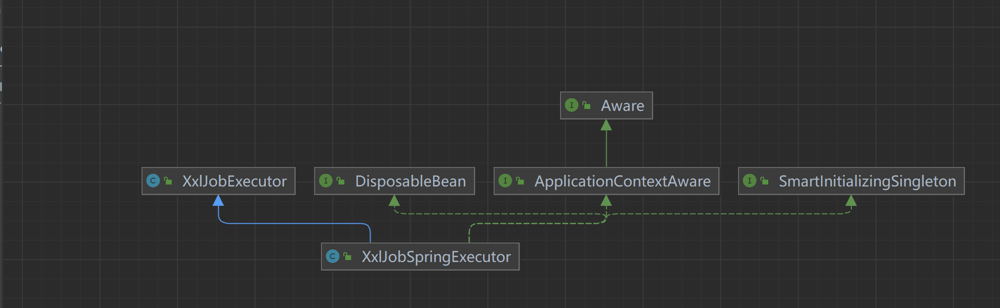

# 三、调度器启动流程

**构建作业执行器**

这里将 XxlJobSpringExecutor 交由容器托管

```java
    @Bean
    public XxlJobSpringExecutor xxlJobExecutor() {
        logger.info(">>>>>>>>>>> xxl-job config init.");
        XxlJobSpringExecutor xxlJobSpringExecutor = new XxlJobSpringExecutor();
        //xxjob管理地址
        xxlJobSpringExecutor.setAdminAddresses(adminAddresses);
        //注册应用名称
        xxlJobSpringExecutor.setAppname(appname);
        //xxl作业执行器注册表地址
        xxlJobSpringExecutor.setAddress(address);
        xxlJobSpringExecutor.setIp(ip);
        xxlJobSpringExecutor.setPort(port);
        //注册地址的token
        xxlJobSpringExecutor.setAccessToken(accessToken);
        //日志路径
        xxlJobSpringExecutor.setLogPath(logPath);
        //日志保存天数
        xxlJobSpringExecutor.setLogRetentionDays(logRetentionDays);

        return xxlJobSpringExecutor;
    }
```

注入了 ApplicationContext 对象。以及实现了 SmartInitializingSingleton 接口，实现该接口的当spring容器初始完成，紧接着执行监听器发送监听后，就会遍历所有的Bean然后初始化所有单例非懒加载的bean，最后在实例化阶段结束时触发回调接口。

<figure><figcaption></figcaption></figure>


```java
// start
@Override
public void afterSingletonsInstantiated() {

    // init JobHandler Repository
    /*initJobHandlerRepository(applicationContext);*/

    // init JobHandler Repository (for method)
    initJobHandlerMethodRepository(applicationContext);

    // refresh GlueFactory
    GlueFactory.refreshInstance(1);

    // super start
    try {
        super.start();
    } catch (Exception e) {
        throw new RuntimeException(e);
    }
}
```

该方法主要做了如下事情：

#### 初始化调度器资源管理器 <a href="#gios9" id="gios9"></a>

1.从spring容器获取所有对象，并遍历查找方法上标记XxlJob注解的方法\
2\. 将xxljob配置的jobname作为key，对象,反射的执行,初始,销毁方法作为value注册jobHandlerRepository 中

```java
    private void initJobHandlerMethodRepository(ApplicationContext applicationContext) {
        if (applicationContext == null) {
            return;
        }
        // init job handler from method
        String[] beanDefinitionNames = applicationContext.getBeanNamesForType(Object.class, false, true);
        for (String beanDefinitionName : beanDefinitionNames) {
            Object bean = applicationContext.getBean(beanDefinitionName);

            Map<Method, XxlJob> annotatedMethods = null;   // referred to ：org.springframework.context.event.EventListenerMethodProcessor.processBean
            try {
                annotatedMethods = MethodIntrospector.selectMethods(bean.getClass(),
                        new MethodIntrospector.MetadataLookup<XxlJob>() {
                            @Override
                            public XxlJob inspect(Method method) {
                                return AnnotatedElementUtils.findMergedAnnotation(method, XxlJob.class);
                            }
                        });
            } catch (Throwable ex) {
                logger.error("xxl-job method-jobhandler resolve error for bean[" + beanDefinitionName + "].", ex);
            }
            if (annotatedMethods==null || annotatedMethods.isEmpty()) {
                continue;
            }

            for (Map.Entry<Method, XxlJob> methodXxlJobEntry : annotatedMethods.entrySet()) {
                Method executeMethod = methodXxlJobEntry.getKey();
                XxlJob xxlJob = methodXxlJobEntry.getValue();
                // regist
                registJobHandler(xxlJob, bean, executeMethod);
            }
        }
    }
```

#### 刷新GlueFactory <a href="#n1tdv" id="n1tdv"></a>

```java
	public static void refreshInstance(int type){
		if (type == 0) {
			glueFactory = new GlueFactory();
		} else if (type == 1) {
			glueFactory = new SpringGlueFactory();
		}
	}
```

#### 核心启动类 <a href="#kb91d" id="kb91d"></a>

该方法主要做了如下事情：

1. 初始化日志文件
2. 初始化admin链接路径存储集合
3. 清除过期日志
4. 回调调度中心任务执行状态
5. 执行内嵌服务

```java
    public void start() throws Exception {

        // init logpath
        XxlJobFileAppender.initLogPath(logPath);//初始化日志文件

        // init invoker, admin-client
        initAdminBizList(adminAddresses, accessToken); //初始化admin链接路径存储集合


        // init JobLogFileCleanThread  清除过期日志
        JobLogFileCleanThread.getInstance().start(logRetentionDays);

        // init TriggerCallbackThread
        TriggerCallbackThread.getInstance().start();

        // init executor-server 执行内嵌服务
        initEmbedServer(address, ip, port, appname, accessToken);
    }
```

#### 初始化日志文件 <a href="#ce7r4" id="ce7r4"></a>

```java
	public static void initLogPath(String logPath){
		// init
		if (logPath!=null && logPath.trim().length()>0) {
			logBasePath = logPath;
		}
		// mk base dir 日志文件不存在则创建
		File logPathDir = new File(logBasePath);
		if (!logPathDir.exists()) {
			logPathDir.mkdirs();
		}
		logBasePath = logPathDir.getPath();

		// mk glue dir 创建glue目录
		File glueBaseDir = new File(logPathDir, "gluesource");
		if (!glueBaseDir.exists()) {
			glueBaseDir.mkdirs();
		}
		glueSrcPath = glueBaseDir.getPath();
	}
```

#### 初始化admin链接路径存储集合 <a href="#di8x2" id="di8x2"></a>

```java
   private void initAdminBizList(String adminAddresses, String accessToken) throws Exception {
        if (adminAddresses!=null && adminAddresses.trim().length()>0) {
            for (String address: adminAddresses.trim().split(",")) { //多个admin地址以,分隔
                if (address!=null && address.trim().length()>0) {

                    AdminBiz adminBiz = new AdminBizClient(address.trim(), accessToken);

                    if (adminBizList == null) {
                        adminBizList = new ArrayList<AdminBiz>();
                    } //将admin地址以及token添加adminBiz中
                    adminBizList.add(adminBiz);
                }
            }
        }
    }
```

#### 主要清除过期日志 <a href="#chpab" id="chpab"></a>

```java
 public void start(final long logRetentionDays){

        // limit min value 日志最大保存天数<3天,直接退出
        if (logRetentionDays < 3 ) {
            return;
        }
        //一天执行一次
        localThread = new Thread(new Runnable() {
            @Override
            public void run() {
                while (!toStop) {
                    try {
                        // clean log dir, over logRetentionDays 查询目录下所有子文件(包含目录)
                        File[] childDirs = new File(XxlJobFileAppender.getLogPath()).listFiles();
                        if (childDirs!=null && childDirs.length>0) {

                            // today   获取今天0点时间
                            Calendar todayCal = Calendar.getInstance();
                            todayCal.set(Calendar.HOUR_OF_DAY,0);
                            todayCal.set(Calendar.MINUTE,0);
                            todayCal.set(Calendar.SECOND,0);
                            todayCal.set(Calendar.MILLISECOND,0);

                            Date todayDate = todayCal.getTime();

                            for (File childFile: childDirs) {

                                // valid  不是目录跳过
                                if (!childFile.isDirectory()) {
                                    continue;
                                }//查询不到'-'则跳过
                                if (childFile.getName().indexOf("-") == -1) {
                                    continue;
                                }

                                // file create date  获取文件创建时间,文件都是以年-月-日命名的
                                Date logFileCreateDate = null;
                                try {
                                    SimpleDateFormat simpleDateFormat = new SimpleDateFormat("yyyy-MM-dd");
                                    logFileCreateDate = simpleDateFormat.parse(childFile.getName());
                                } catch (ParseException e) {
                                    logger.error(e.getMessage(), e);
                                }
                                if (logFileCreateDate == null) {
                                    continue;
                                }
                                //大于日志最大存活时间则清除
                                if ((todayDate.getTime()-logFileCreateDate.getTime()) >= logRetentionDays * (24 * 60 * 60 * 1000) ) {
                                    FileUtil.deleteRecursively(childFile);//超过保存天数则清除日志
                                }

                            }
                        }

                    } catch (Exception e) {
                        if (!toStop) {
                            logger.error(e.getMessage(), e);
                        }

                    }

                    try { //睡眠一天处理
                        TimeUnit.DAYS.sleep(1);
                    } catch (InterruptedException e) {
                        if (!toStop) {
                            logger.error(e.getMessage(), e);
                        }
                    }
                }
                logger.info(">>>>>>>>>>> xxl-job, executor JobLogFileCleanThread thread destory.");

            }
        });
        localThread.setDaemon(true);
        localThread.setName("xxl-job, executor JobLogFileCleanThread");
        localThread.start();
    }
```

#### 回调调度中心任务执行状态 <a href="#jc4i6" id="jc4i6"></a>

具体看主动触发->客户端回调服务端

```java
public void start() {

    // valid 是否有配置admin路径
    if (XxlJobExecutor.getAdminBizList() == null) {
        logger.warn(">>>>>>>>>>> xxl-job, executor callback config fail, adminAddresses is null.");
        return;
    }

    // callback
    triggerCallbackThread = new Thread(new Runnable() {

        @Override
        public void run() {

            // normal callback
            while(!toStop){
                try {
                    //获取回调参数
                    HandleCallbackParam callback = getInstance().callBackQueue.take();
                    if (callback != null) {

                        // callback list param
                        List<HandleCallbackParam> callbackParamList = new ArrayList<HandleCallbackParam>();
                        //移除队列中所有元素到callbackParamList中
                        int drainToNum = getInstance().callBackQueue.drainTo(callbackParamList);
                        callbackParamList.add(callback);

                        // callback, will retry if error 通知admin
                        if (callbackParamList!=null && callbackParamList.size()>0) {
                            doCallback(callbackParamList);
                        }
                    }
                } catch (Exception e) {
                    if (!toStop) {
                        logger.error(e.getMessage(), e);
                    }
                }
            }

            // last callback
            try {
                List<HandleCallbackParam> callbackParamList = new ArrayList<HandleCallbackParam>();
                int drainToNum = getInstance().callBackQueue.drainTo(callbackParamList);
                if (callbackParamList!=null && callbackParamList.size()>0) {
                    doCallback(callbackParamList);
                }
            } catch (Exception e) {
                if (!toStop) {
                    logger.error(e.getMessage(), e);
                }
            }
            logger.info(">>>>>>>>>>> xxl-job, executor callback thread destory.");

        }
    });
    triggerCallbackThread.setDaemon(true);
    triggerCallbackThread.setName("xxl-job, executor TriggerCallbackThread");
    triggerCallbackThread.start();


    // retry
    triggerRetryCallbackThread = new Thread(new Runnable() {
        @Override
        public void run() {
            while(!toStop){
                try {
                    retryFailCallbackFile();
                } catch (Exception e) {
                    if (!toStop) {
                        logger.error(e.getMessage(), e);
                    }

                }
                try {
                    //注册到服务端(心跳30S)
                    TimeUnit.SECONDS.sleep(RegistryConfig.BEAT_TIMEOUT);
                } catch (InterruptedException e) {
                         if (!toStop) {
                         logger.error(e.getMessage(), e);
                         }
                         }
                         }
                         logger.info(">>>>>>>>>>> xxl-job, executor retry callback thread destory.");
                         }
                         });
                         triggerRetryCallbackThread.setDaemon(true);
                         triggerRetryCallbackThread.start();

                         }
```

#### 执行内嵌服务 <a href="#rejhq" id="rejhq"></a>

该方法主要做了如下事情：

1. 使用netty开放端口，等待服务端调用
2. 注册到服务端(心跳30S)
3. 向服务端申请剔除服务

```java
private void initEmbedServer(String address, String ip, int port, String appname, String accessToken) throws Exception {

    // fill ip port  若没设置端口,则寻找可用端口
    port = port>0?port: NetUtil.findAvailablePort(9999);
    ip = (ip!=null&&ip.trim().length()>0)?ip: IpUtil.getIp(); //若没设置IP，则获取本机Ip

    // generate address 构造地址,若没设置地址,则将ip,port拼接成地址
    if (address==null || address.trim().length()==0) {
        String ip_port_address = IpUtil.getIpPort(ip, port);   // registry-address：default use address to registry , otherwise use ip:port if address is null
        address = "http://{ip_port}/".replace("{ip_port}", ip_port_address);
    }

    // accessToken
    if (accessToken==null || accessToken.trim().length()==0) {
        logger.warn(">>>>>>>>>>> xxl-job accessToken is empty. To ensure system security, please set the accessToken.");
    }

    // start  启动嵌入服务器 ,向服务端注册,以及监听端口,主要服务服务端调用。
    embedServer = new EmbedServer();
    embedServer.start(address, port, appname, accessToken);
}
```

```java
public void start(final String address, final int port, final String appname, final String accessToken) {
    executorBiz = new ExecutorBizImpl();
    thread = new Thread(new Runnable() {

        @Override
        public void run() {

            // param
            EventLoopGroup bossGroup = new NioEventLoopGroup();
            EventLoopGroup workerGroup = new NioEventLoopGroup();
            ThreadPoolExecutor bizThreadPool = new ThreadPoolExecutor(
                0,
                200,
                60L,
                TimeUnit.SECONDS,
                new LinkedBlockingQueue<Runnable>(2000),
                new ThreadFactory() {
                    @Override
                    public Thread newThread(Runnable r) {
                        return new Thread(r, "xxl-rpc, EmbedServer bizThreadPool-" + r.hashCode());
                    }
                },
                new RejectedExecutionHandler() {
                    @Override
                    public void rejectedExecution(Runnable r, ThreadPoolExecutor executor) {
                        throw new RuntimeException("xxl-job, EmbedServer bizThreadPool is EXHAUSTED!");
                    }
                });


            try {
                // start server
                ServerBootstrap bootstrap = new ServerBootstrap();
                bootstrap.group(bossGroup, workerGroup)
                    .channel(NioServerSocketChannel.class)
                    .childHandler(new ChannelInitializer<SocketChannel>() {
                        @Override
                        public void initChannel(SocketChannel channel) throws Exception {
                            channel.pipeline()
                                .addLast(new IdleStateHandler(0, 0, 30 * 3, TimeUnit.SECONDS))  // beat 3N, close if idle
                                .addLast(new HttpServerCodec())
                                .addLast(new HttpObjectAggregator(5 * 1024 * 1024))  // merge request & reponse to FULL
                                .addLast(new EmbedHttpServerHandler(executorBiz, accessToken, bizThreadPool));
                        }
                    })
                    .childOption(ChannelOption.SO_KEEPALIVE, true);

                // bind 异步绑定port上
                ChannelFuture future = bootstrap.bind(port).sync();

                logger.info(">>>>>>>>>>> xxl-job remoting server start success, nettype = {}, port = {}", EmbedServer.class, port);

                // start registry  //注册
                startRegistry(appname, address);

                // wait util stop
                future.channel().closeFuture().sync();

            } catch (InterruptedException e) {
            if (e instanceof InterruptedException) {
            logger.info(">>>>>>>>>>> xxl-job remoting server stop.");
        } else {
            logger.error(">>>>>>>>>>> xxl-job remoting server error.", e);
        }
        } finally {
            // stop
            try {
            workerGroup.shutdownGracefully();
            bossGroup.shutdownGracefully();
        } catch (Exception e) {
            logger.error(e.getMessage(), e);
        }
        }

        }

        });
            thread.setDaemon(true);	// daemon, service jvm, user thread leave >>> daemon leave >>> jvm leave
            thread.start();
        }
```

向调度中心注册,默认30秒执行一次

```java
public void startRegistry(final String appname, final String address) {
    // start registry
    ExecutorRegistryThread.getInstance().start(appname, address);
}
-----------------------------------------------
    registryThread = new Thread(new Runnable() {
        @Override
        public void run() {

            // registry
            while (!toStop) {
                try {
                    RegistryParam registryParam = new RegistryParam(RegistryConfig.RegistType.EXECUTOR.name(), appname, address);
                    for (AdminBiz adminBiz: XxlJobExecutor.getAdminBizList()) {
                        try {
                            ReturnT<String> registryResult = adminBiz.registry(registryParam);
                            if (registryResult!=null && ReturnT.SUCCESS_CODE == registryResult.getCode()) {
                                registryResult = ReturnT.SUCCESS;
                                logger.debug(">>>>>>>>>>> xxl-job registry success, registryParam:{}, registryResult:{}", new Object[]{registryParam, registryResult});
                                break;
                            } else {
                                logger.info(">>>>>>>>>>> xxl-job registry fail, registryParam:{}, registryResult:{}", new Object[]{registryParam, registryResult});
                            }
                        } catch (Exception e) {
                            logger.info(">>>>>>>>>>> xxl-job registry error, registryParam:{}", registryParam, e);
                        }

                    }
                } catch (Exception e) {
                    if (!toStop) {
                        logger.error(e.getMessage(), e);
                    }

                }

                try {
                    if (!toStop) {
                        TimeUnit.SECONDS.sleep(RegistryConfig.BEAT_TIMEOUT);
                    }
                } catch (InterruptedException e) {
                    if (!toStop) {
                        logger.warn(">>>>>>>>>>> xxl-job, executor registry thread interrupted, error msg:{}", e.getMessage());
                    }
                }
            }

            // registry remove
            try {
                RegistryParam registryParam = new RegistryParam(RegistryConfig.RegistType.EXECUTOR.name(), appname, address);
                for (AdminBiz adminBiz: XxlJobExecutor.getAdminBizList()) {
                    try {
                        ReturnT<String> registryResult = adminBiz.registryRemove(registryParam);
                        if (registryResult!=null && ReturnT.SUCCESS_CODE == registryResult.getCode()) {
                            registryResult = ReturnT.SUCCESS;
                            logger.info(">>>>>>>>>>> xxl-job registry-remove success, registryParam:{}, registryResult:{}", new Object[]{registryParam, registryResult});
                                        break;
                                        } else {
                                        logger.info(">>>>>>>>>>> xxl-job registry-remove fail, registryParam:{}, registryResult:{}", new Object[]{registryParam, registryResult});
                                        }
                                        } catch (Exception e) {
                                        if (!toStop) {
                                        logger.info(">>>>>>>>>>> xxl-job registry-remove error, registryParam:{}", registryParam, e);
                                        }

                                        }

                                        }
                                        } catch (Exception e) {
                                        if (!toStop) {
                                        logger.error(e.getMessage(), e);
                                        }
                                        }
                                        logger.info(">>>>>>>>>>> xxl-job, executor registry thread destroy.");

                                        }
                                        });
```

```
@Override
    public ReturnT<String> registry(RegistryParam registryParam) {
        return XxlJobRemotingUtil.postBody(addressUrl + "api/registry", accessToken, timeout, registryParam, String.class);
}
```

```java
public void start(final String appname, final String address){

    // valid appname不允许为null
    if (appname==null || appname.trim().length()==0) {
        logger.warn(">>>>>>>>>>> xxl-job, executor registry config fail, appname is null.");
        return;
    }//服务端地址不能为null
    if (XxlJobExecutor.getAdminBizList() == null) {
        logger.warn(">>>>>>>>>>> xxl-job, executor registry config fail, adminAddresses is null.");
        return;
    }

    registryThread = new Thread(new Runnable() {
        @Override
        public void run() {

            // registry
            while (!toStop) {
                try {
                    RegistryParam registryParam = new RegistryParam(RegistryConfig.RegistType.EXECUTOR.name(), appname, address);
                    for (AdminBiz adminBiz: XxlJobExecutor.getAdminBizList()) {
                        try {
                            ReturnT<String> registryResult = adminBiz.registry(registryParam); //向server注册服务(http请求),注册内容appname,当前服务监听地址
                            if (registryResult!=null && ReturnT.SUCCESS_CODE == registryResult.getCode()) { //访问成功
                                registryResult = ReturnT.SUCCESS;
                                logger.debug(">>>>>>>>>>> xxl-job registry success, registryParam:{}, registryResult:{}", new Object[]{registryParam, registryResult});
                                break;
                            } else {
                                logger.info(">>>>>>>>>>> xxl-job registry fail, registryParam:{}, registryResult:{}", new Object[]{registryParam, registryResult});
                            }
                        } catch (Exception e) {
                            logger.info(">>>>>>>>>>> xxl-job registry error, registryParam:{}", registryParam, e);
                        }

                    }
                } catch (Exception e) {
                    if (!toStop) {
                        logger.error(e.getMessage(), e);
                    }

                }

                try {
                    if (!toStop) { //心跳时间30秒
                        TimeUnit.SECONDS.sleep(RegistryConfig.BEAT_TIMEOUT);
                    }
                } catch (InterruptedException e) {
                    if (!toStop) {
                        logger.warn(">>>>>>>>>>> xxl-job, executor registry thread interrupted, error msg:{}", e.getMessage());
                    }
                }
            }

            // registry remove  删除注册
            try {
                RegistryParam registryParam = new RegistryParam(RegistryConfig.RegistType.EXECUTOR.name(), appname, address);
                for (AdminBiz adminBiz: XxlJobExecutor.getAdminBizList()) {
                    try {  
                        ReturnT<String> registryResult = adminBiz.registryRemove(registryParam);
                            if (registryResult!=null && ReturnT.SUCCESS_CODE == registryResult.getCode()) {
                            registryResult = ReturnT.SUCCESS;
                            logger.info(">>>>>>>>>>> xxl-job registry-remove success, registryParam:{}, registryResult:{}", new Object[]{registryParam, registryResult});
                            break;
                            } else {
                            logger.info(">>>>>>>>>>> xxl-job registry-remove fail, registryParam:{}, registryResult:{}", new Object[]{registryParam, registryResult});
                            }
                            } catch (Exception e) {
                            if (!toStop) {
                            logger.info(">>>>>>>>>>> xxl-job registry-remove error, registryParam:{}", registryParam, e);
                            }

                            }

                            }
                            } catch (Exception e) {
                            if (!toStop) {
                            logger.error(e.getMessage(), e);
                            }
                            }
                            logger.info(">>>>>>>>>>> xxl-job, executor registry thread destory.");

                            }
                            });
                            registryThread.setDaemon(true);
                            registryThread.setName("xxl-job, executor ExecutorRegistryThread");
                            registryThread.start();
                            }
```

调度中心api接口：

```java
  @RequestMapping("/{uri}")
    @ResponseBody
    @PermissionLimit(limit=false)
    public ReturnT<String> api(HttpServletRequest request, @PathVariable("uri") String uri, @RequestBody(required = false) String data) {

        // valid
        if (!"POST".equalsIgnoreCase(request.getMethod())) {
            return new ReturnT<String>(ReturnT.FAIL_CODE, "invalid request, HttpMethod not support.");
        }
        if (uri==null || uri.trim().length()==0) {
            return new ReturnT<String>(ReturnT.FAIL_CODE, "invalid request, uri-mapping empty.");
        }
        if (XxlJobAdminConfig.getAdminConfig().getAccessToken()!=null
                && XxlJobAdminConfig.getAdminConfig().getAccessToken().trim().length()>0
                && !XxlJobAdminConfig.getAdminConfig().getAccessToken().equals(request.getHeader(XxlJobRemotingUtil.XXL_JOB_ACCESS_TOKEN))) {
            return new ReturnT<String>(ReturnT.FAIL_CODE, "The access token is wrong.");
        }

        // services mapping
        if ("callback".equals(uri)) {  //执行器结果回调接口
            List<HandleCallbackParam> callbackParamList = GsonTool.fromJson(data, List.class, HandleCallbackParam.class);
            return adminBiz.callback(callbackParamList);
        } else if ("registry".equals(uri)) { //向调度中心注册
            RegistryParam registryParam = GsonTool.fromJson(data, RegistryParam.class);
            return adminBiz.registry(registryParam);
        } else if ("registryRemove".equals(uri)) {  //删除注册
            RegistryParam registryParam = GsonTool.fromJson(data, RegistryParam.class);
            return adminBiz.registryRemove(registryParam);
        } else {
            return new ReturnT<String>(ReturnT.FAIL_CODE, "invalid request, uri-mapping("+ uri +") not found.");
        }

    }
```
